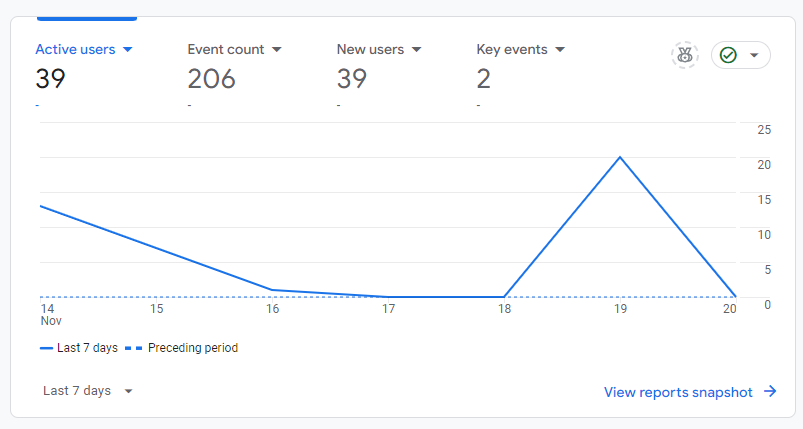
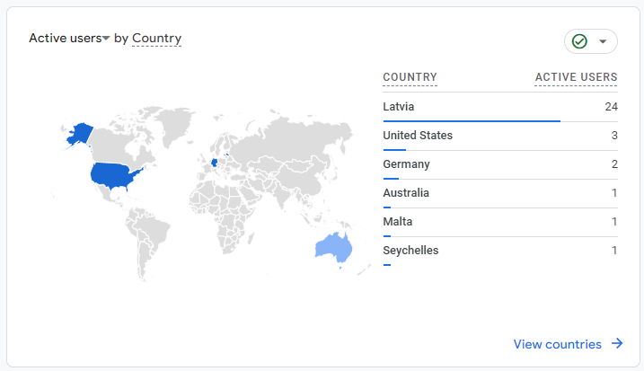
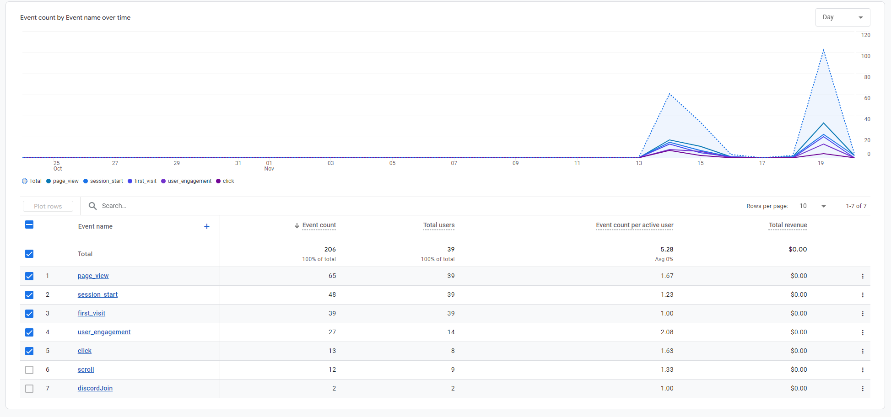

+++
title = "From statistics to profit: An unexpected data journey"
date = 2024-12-25

[taxonomies]
categories = ["Analytics", "Business"]
+++

Three websites, two pivots, and one profitable accident. That's how our Statistics and Data Analysis course project evolved from studying website metrics to accidentally building a casino affiliate business. Here's the story of how we stopped worrying about perfect analytics and started making actual money.

<!-- more -->
---

Google Analytics has this way of making you feel simultaneously overwhelmed and underwhelmed:

<div class="tenor-gif-embed" data-postid="24033180" data-share-method="host" data-aspect-ratio="1.77778" data-width="100%"><a href="https://tenor.com/view/confused-math-zach-galifianakis-thinking-gif-24033180">Confused Math GIF</a>from <a href="https://tenor.com/search/confused-gifs">Confused GIFs</a></div> <script type="text/javascript" async src="https://tenor.com/embed.js"></script>

Overwhelmed by the sheer amount of data, underwhelmed by how little of it actually matters. After spending weeks diving deep into analytics tools and metrics, we learned that sometimes the most valuable data isn't in your analytics dashboard at all.

## Background

During the Statistics and Data Analysis course, our team of three had an ambitious plan: analyze website metrics across three different projects:

1. A new Business Academy website
2. Our course cooperative's digital agency site
3. A casino affiliate website aggregating Latvian casinos ([mansbonuss.com](https://mansbonuss.com))

The goal was to compare metrics across different types of websites and extract meaningful insights. However, as often happens in the real world, our plans took an interesting turn.

<div class="tenor-gif-embed" data-postid="5012719" data-share-method="host" data-aspect-ratio="1.77778" data-width="100%"><a href="https://tenor.com/view/plans-change-gif-5012719">Plans Change GIF</a>from <a href="https://tenor.com/search/plans-gifs">Plans GIFs</a></div> <script type="text/javascript" async src="https://tenor.com/embed.js"></script>

## The Analytics Landscape

After researching and testing different analytics solutions, here's what we learned about each:

### Google Analytics 4 (GA4)
**The Good:**
- Free with unlimited events
- Deep integration with Google's ecosystem
- Advanced user behavior tracking
- Custom event tracking
- Machine learning insights

**The Bad:**
- Complex implementation for custom events
- Significant learning curve
- Data sampling on free tier
- Privacy concerns with GDPR
- Historical data limited to 14 months

### Meta Pixel (Facebook Pixel)
**The Good:**
- Excellent for ad campaign tracking
- Detailed demographic data
- Built-in event tracking
- Good for retargeting
- Real-time data

**The Bad:**
- Limited to Meta's ecosystem
- Privacy concerns (iOS 14.5+ impact)
- Requires user consent
- Not great for general analytics
- Can affect site performance

### Plausible Analytics
**The Good:**
- Simple, clean interface
- Privacy-focused (EU-hosted)
- No cookie consent needed
- Fast loading (under 1KB)
- Easy to understand metrics

**The Bad:**
- Paid only (€9/month minimum)
- Basic event tracking
- No user-level data
- Limited custom reporting
- No raw data access

### Matomo (formerly Piwik)
**The Good:**
- Full data ownership
- GDPR compliant out of the box
- Similar features to GA
- No data sampling
- Flexible hosting options

**The Bad:**
- Resource-intensive if self-hosted
- Complex setup for custom tracking
- Higher costs at scale
- Limited community support
- Less intuitive than modern tools

## Our Analytics Stack Decision

After evaluating our needs and constraints, we ended up on:

1. **Google Analytics 4** for:
   - Core website metrics
   - User behavior tracking
   - Custom event tracking
   - Conversion tracking

2. **Meta Pixel** for:
   - Ad campaign performance
   - Audience insights
   - Retargeting capabilities
   - Social traffic analysis

3. (additional) **TikTok** purhcased views for:
   - Bigger audience reach
   - More precise targeting
   - Better conversion rates

While we didn't use Meta Pixel yet, we're planning to use it in the future for paid ads.

Here's why GA4 and Meta Pixel is the best choice for us:

1. **Cost Efficiency**: The free tier is more than enough for our needs
2. **Complementary Data**: GA4 for general analytics, Meta Pixel for social insights
3. **Future Proofing**: Learning industry-standard tools
4. **Marketing Potential**: Ready for future paid advertising

## The Unexpected Turn

While setting up analytics across our three projects, something interesting happened. Our casino affiliate website started getting real traffic, and more importantly - potential for real revenue. Our focus quickly shifted from pure analytics to:

1. Understanding affiliate partnerships
2. Tracking conversion rates
3. Optimizing for actual revenue

This wasn't just about numbers anymore - it was about real business opportunities. While we were supposed to be studying statistics, we found ourselves negotiating affiliate deals and optimizing landing pages.

## What We Actually Learned

### From Analytics:
Here's what our traffic sources looked like:





Key insights:
1. Mobile traffic dominated (over 60%)
2. Users spent more time on comparison pages
3. Organic search was our main traffic source

### From Business Reality:
1. Revenue potential matters more than perfect analytics
2. Real user behavior often surprises you
3. Being flexible with your goals is crucial

## The Tools We Actually Used

Our final tech stack was simpler than planned:

```javascript
// Google Tag Manager for tracking casino clicks
dataLayer.push({
'event': 'casino_click',
'casino_name': 'Example Casino',
'button_location': 'comparison_table',
'device_type': 'mobile'
});

```

1. **Google Analytics 4**: For basic metrics
2. **Google Tag Manager**: For event tracking
3. **Google Sheets**: For revenue tracking (sometimes simple is best)

## Key Takeaways

1. **Start Simple**: Don't try to track everything at once
2. **Follow the Money**: When revenue opportunities appear, don't ignore them
3. **Real Data > Perfect Data**: Some insights are better than no insights
4. **Stay Flexible**: Your initial plan might not survive contact with reality

## Looking Forward

While we didn't complete our original analytics comparison across three websites, we ended up learning something more valuable - how to use data to drive real business decisions. Sometimes the best lessons come from the projects that don't go as planned.

The casino affiliate website continues to grow, and we're now focusing on:
1. Optimizing conversion rates
2. Expanding our casino partnerships
3. Using data to make better content decisions
4. Actually making money (turns out this is important)

## Final Thoughts

Our journey from academic analytics project to potential business venture taught us that while data is important, action is essential. Sometimes the best data insights come from actually building something and seeing what happens.

Now, if you'll excuse me, I need to go check our conversion rates... or maybe just build another casino comparison table.

[Assess for Success: Marketing Analytics and Measurement](https://www.coursera.org/account/accomplishments/certificate/9O29RU7Q7E9F)
[Google Analytics Certification](https://skillshop.credential.net/82830425-1596-4efc-9cfb-8c093d39506e#acc.1LoVj2zq)