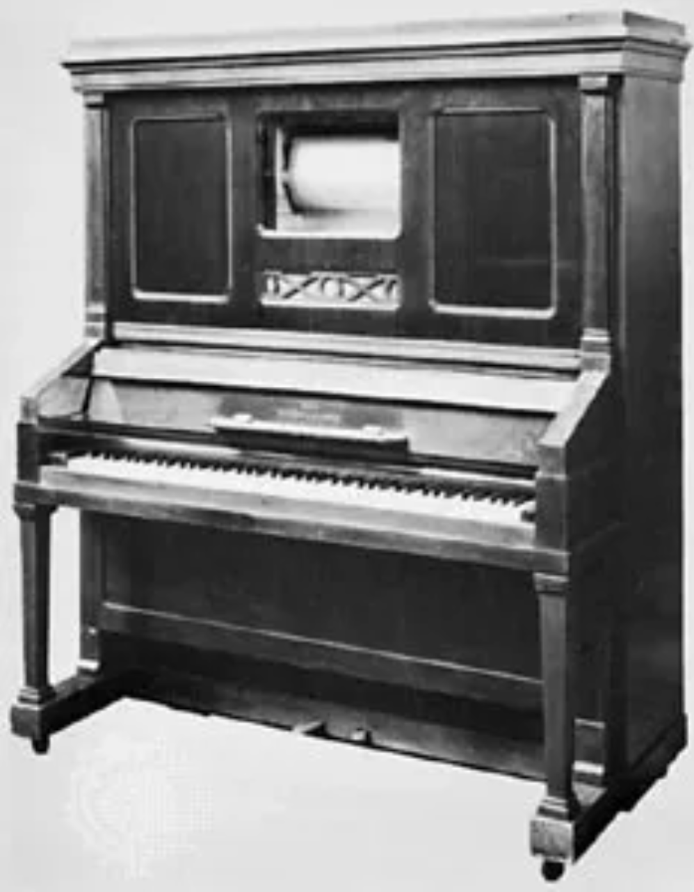
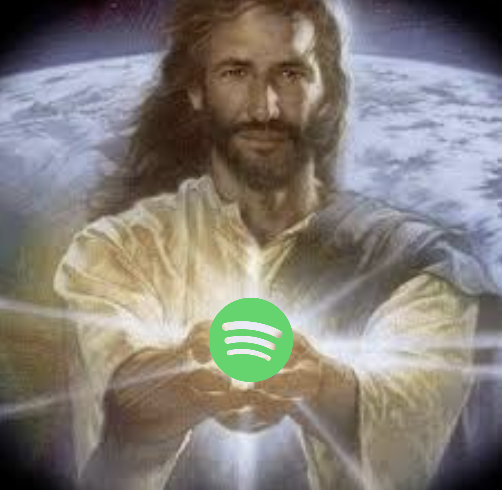
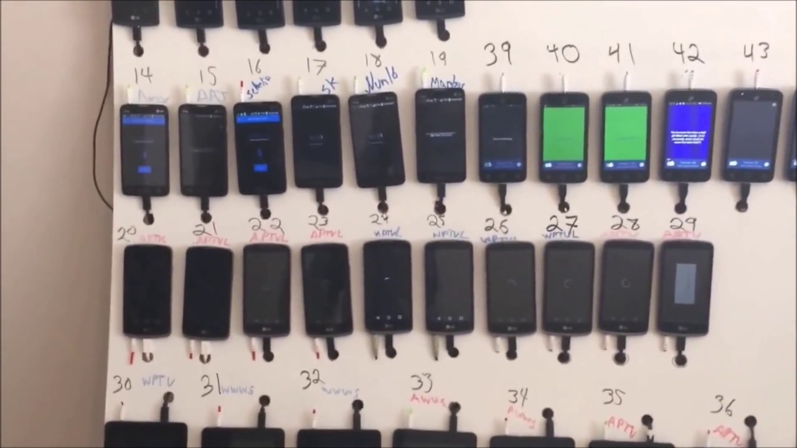

+++
title = "Maximizing copyright for monetary gain"
date = 2024-09-28

[taxonomies]
categories = ["Music", "Guides"]
+++

I accidentally made a banger remix and got away without disclosing copyrights. I wanted to understand how it works, so I dove into the world of copyrights and royalties. Here's what I found.

<!-- more -->
---

If you're a musician, you will find the following GIF very resonating:

<a href="https://tenor.com/view/credit-card-credit-card-debit-card-debit-gif-27376677">Credit Card GIF</a>from <a href="https://tenor.com/search/credit-gifs">Credit GIFs</a>
 

Yes, that's you paying for all the samples, plugins, and instruments you use to create your music. Not only that, but you also have to pay for advertising and marketing to make people aware of your existence.

Music is an expensive hobby. From music production to distribution, marketing, and live shows, there's a lot of costs involved. Most of the time, the money is coming from your own pocket.

It doesn't have to be this way, though. You can make money from your music without having to sell merch, play gigs, or even record a single song. In this blog I will talk about how to utilize copyright to make money from your music. These tips range from the obvious to the obscure, especially the *not recording a single song* part, but they all contribute to the fact that music is a business, and you can make a buck from it.

## Background

During the the Jurisprudence course at Business Academy, I was still unsure as to why a song me and a friend remixed was not taken down from any streaming platforms. Zigmars Liepiņš is a famous Latvian composer and author of the song we were remixing - 'Septītās Debesis'. We briefly exchanged emails regarding copyright with Zigmars, who then requested me to send over the final mix before publishing it. So I did, and in response to that, there was no response.

<a href="https://tenor.com/view/tumbleweed-boring-empty-rolling-theres-no-one-here-gif-17171715">Tumbleweed Boring GIF</a>from <a href="https://tenor.com/search/tumbleweed-gifs">Tumbleweed GIFs</a>
 

There was one disclosed point, though - we had to name the song something else than 'Septītās Debesis' if we were to register it. I didn't know what any of these big words meant at the time, so I named it 'Septītās Debesis', slapped it on DistroKid, closed my eyes, and prayed.

Here's the song if you want to listen to it:
<iframe style="border-radius:12px" src="https://open.spotify.com/embed/track/4FKzwsolF0GTWkZRFfDvcr?utm_source=generator" width="100%" height="152" frameBorder="0" allowfullscreen="" allow="autoplay; clipboard-write; encrypted-media; fullscreen; picture-in-picture" loading="lazy"></iframe>

I couldn't accept the fact it worked by pure accident, so I decided to dig deeper.

## Understanding Copyright

**Copyright protects your work automatically**: Understanding how copyright works is crucial for creators. Here's a brief explanation:
   - Copyright is a form of intellectual property protection that automatically applies to original works of authorship, including musical compositions, as soon as they are created and fixed in a tangible form.
   - It grants the creator exclusive rights to reproduce, distribute, perform, display, and create derivative works based on the original creation.
   - In most countries, copyright protection lasts for the life of the author plus an additional 70 years after their death, also known as the life+70 rule. **Fun fact**: if there are multiple authors, it lasts for 70 years after the last author's death.
   - While registration is not required for copyright protection, registering your work with the copyright office of your country can provide additional benefits, such as the ability to sue for infringement and potentially recover statutory damages and attorney's fees.
   - It's important to note that copyright protects the expression of ideas, not the ideas themselves. This means that while your specific melody and lyrics are protected, the general concept or theme of your song is not.

## Types of Copyright Income

There are four main sources of copyright income you can generate as a musician:

1. Mechanical Royalties
2. Public Performance Royalties
3. Synchronization Royalties
4. Other/Ancillary Royalties

Let's explore each of these in detail.

### 1. Mechanical Royalties

Mechanical royalties are payments made for the reproduction and distribution of your music. It all dates back to 1897 when the American engineer E.S. Votey invented the first player piano - a piano that could play music by itself using paper rolls. Back then, the song was *mechanically* printed on these paper rolls, and that's where the term "mechanical" comes from.

Years passed, and mechanical royalties turned into CD sales, vinyl records. Then, next comes - Spotify streams.

Today, the most widespread mechanical royalties come from streaming services - Spotify, Apple Music, YouTube Music, etc. But if you go to a store and buy a CD or a vinyl, that's still a mechanical royalty and it goes to the artist. Though, in this case, the store is most likely a retailer that already bought the CD from a record label or distributor, so the royalties were already paid. With streaming, it's a bit different.

When a user listens to a song on Spotify, YouTube, or any other streaming service, the service pays the rights holders (that'd be the artist, record label, and sometimes publishers) a small fee per stream. The fee depends on the market, but on average it's about 0.005 USD per stream. If Spotify gets 1 million streams of your song, and you own the copyright, you will get 5000 USD.

To maximize your mechanical royalties, you can:

- Consider working with an independent record label to help distribute your music.
- Ensure your music is available on all major streaming platforms.
- Keep track of your streams and downloads to verify your royalty payments.
- Make good music. And more music.

If you've never gone through the process of releasing a song, you might have heard about platforms like DistroKid or TuneCore. Even if not - these are simply platforms that help you get your music on all the major streaming platforms, they're called *music distributors*.

What's the difference between indepedent publishing and record label publishing?

**Independent Publishing (e.g., DistroKid, TuneCore):**
- You retain full control over your music and rights
- Higher royalty rates (typically 80-100%)
- Flexibility to release music on your own schedule
- Lower upfront costs
- You're responsible for your own marketing and promotion
- You handle administrative tasks yourself

**Record Label Publishing:**
- Access to industry connections and professional support
- Potential for advances against future royalties
- Lower royalty rates (often 10-50%)
- Less control over creative decisions and release schedules
- Potential for wider reach and audience
- Marketing and promotional support provided

Record labels sound like a better choice (and generally are a better choice), but it takes a certain level of skill to get into a label. Ultimately, the choice depends on your goals, resources, and career stage and your values. If a label doesn't represent your values, it might be better to stay independent. Many artists start with independent publishing and later transition to labels as their careers grow.

### 2. Public Performance Royalties

These royalties are generated when your music is played in public spaces. In the Copyright law, a public performance is defined as:
   - Places where people can freely enter and exit
   - Large gatherings that aren't just friends and family
   - Venues where music is being transmitted or played through a device

Few examples:

- **A public performance is**: a concert, a festival, a bar, a club, a restaurant, a hotel, etc. Also playing your favorite song on a speaker in your yard is a public performance.
- **A public performance is not**: a wedding, surprisingly.

To collect these royalties, you have to register with a Performing Rights Organization (PRO). As I'm based in Latvia, the PRO I would typically register with is [AKKA/LAA](https://www.akka-laa.lv/lv). However, AKKA LAA has been criticized for its monopolistic practices and high tariffs for public performance royalties. The Latvian Competition Council has previously ruled that AKKA LAA abused its dominant position by charging excessive rates compared to similar organizations in neighboring countries like Estonia and Lithuania. [source](https://www.kp.gov.lv/en/article/competition-councils-decision-abuse-dominant-position-akkalaa-enters-force)

Be vary of PROs that don't have any competition. They can easily abuse their monopolistic status and charge extortionate rates. Thankfully, in EU, you can register with a PRO located in any country. But why there's still not a boycott against AKKA/LAA? Well, it only makes sense that songs in Latvian are registered with a Latvian PRO. You can think of it like a cultural vendor-lock. However, if you believe another PRO will better serve your interests and values, you're completely free to register with them instead.

Remember, the PRO will handle licensing and royalty calculations on your behalf. (or at least they should (I'm looking at you AKKA/LAA ))

### 3. Synchronization Royalties

Sync royalties come from the use of your music in visual media like films, TV shows, commercials, or video games.

*Imagine epic 'Pirates of the Caribbean' theme song playing*

<a href="https://tenor.com/view/pirate-of-pirate-of-the-carribean-jack-sparrow-pirati-dei-caraibi-sad-gif-14519798">Pirate Of Pirate Of The Carribean GIF</a>from <a href="https://tenor.com/search/pirate+of-gifs">Pirate Of GIFs</a>
 

To pursue sync opportunities:

1. If you're your own publisher, research films or shows that might be interested in your music.
2. Reach out to production companies or music supervisors.
3. Carefully evaluate any offers you receive.
4. Negotiate a deal, which could be a percentage of revenue or a flat fee.

Synchronization royalties are notably the best way to make money from your music. It depends on the type of deal - if it's for a movie that's gonna to play in schools, it's probably going to be a small deal, but if it's for a movie that's going to play in cinemas, it's probably going to be a bigger deal. Take Hans Zimmer's *Time* from *Inception* - it's one of the most famous movie songs of all time, and it's still being played today.

While you can aim for sync royalties with your music, that's a long process and not something you can rely on. It's more about making music that expresses your authentic self and putting it out there. If it resonates with people, sync placements will happen eventually. A way to increase your chances, though, is getting a publisher to help you with sync opportunities. Publisher is like your partner - it's in their best interest to hook you up with good deals. However, publishers, like record labels, are hard to get into, and they often have their own roster of artists.

### 4. Other/Ancillary Royalties

This is where you let your mind roam - what other ways are there earn from your music? There are some generic ones:

- **Merchandising Rights**

If you sell merchandise featuring your brand or music (like T-shirts, posters, etc.), you can earn additional income. Profits from merchandise sales can be substantial, especially during tours or events where fans are eager to support you.
- **Licensing for Covers**

If other artists cover your songs, they need to obtain a mechanical license to do so, generating additional royalties for you as the original songwriter. Each cover version can generate mechanical royalties similar to those from original recordings.
- **Sheet music sales & lyric displays**

By utilizing a marketplace where you put your songs transcribed to sheet music, you can get some direct sales. As well as licensing your lyrics for use on lyric display websites or apps can go a long way. Lyric videos on their own perform very well btw.
- **Patreon**

Although it's less to do with copyright, I think it's worth mentioning - Patreon is a platform that allows you to sell exclusive music to your fans. You can set the price, and the fan can pay you a monthly subscription to access your music. It's a great way to make money from your music, and you can even gamify it by giving your patrons access to exclusive content, like unreleased songs, behind-the-scenes looks, or even direct involvement in the creative process.

I could really keep going. There are many platforms that allow you to push the boundaries as an artist. Another example would be a musical toothbrush - it requires copyright to the music, too. So if making toothbrush jingles for a living sounds like your type of thing to do, go for it, magic toothbrush man!

## Maximizing Your Copyright Income

Now for a few takeaways from what was discussed - to make the most of your copyright:

1. Register as an artist with a PRO (Performance Rights Organization).
2. Consider working with a music publisher to help manage your rights and find opportunities.
3. Continue creating authentic, high-quality music to increase your chances of success.
4. Stay informed about the different types of royalties and actively pursue opportunities in each area.

Aside from copyright, I want to also talk about other crucial factors that can boost your music, since it still closely correlates with copyright. So, first and foremost - marketing. And again - **MARKETING**. You simply cannot overlook marketing entirely. Nobody will discover your music if you don't make it resonate with and audience. So here's a few extra tips:

1. **Create quality content**: Focus on producing the best music you can. Quality content is more likely to be shared and playlisted organically.

2. **Utilize Spotify for Artists**: This free tool provides valuable insights and promotional opportunities. Use it to customize your profile, submit songs for playlist consideration, and understand your audience better.

3. **Promote on social media**: Share your Spotify links on your social media platforms. Create engaging content around your music to encourage followers to stream your tracks.

4. **Collaborate with other artists**: Collaborations can help you reach new audiences and potentially get featured on more playlists.

5. **Engage with your fans**: Respond to comments, create special playlists for your fans, and keep them updated about new releases.

6. **Submit to playlist curators**: Research and submit your music to playlist curators who feature similar artists.

Now, all of these tips I talked about in this blog so far sound great and can get you far, but there's just one thing, though - **the game is rigged**. We all already know that. If you didn't, well, here's some bad or good news for you, depending on how you approach the situation.

## Spotify phone farms

To understand what even is this you're seeing, you need to understand how Spotify algorithm works for counting song streams. A stream is counted:

- Multiple times for the same user, even if they listen to the song more than once.
- When a user listens to the song for at least 30 seconds.
- When the song is looped, the same rules apply.

You see where this is going? An album of 10 songs, each the length of 3min, can be streamed in just 15 minutes. The resulting amount of streams is not that impressive with just one user. However, if you have 1000 listeners, and each of them streams your album 10 times, you can get 10000 streams in just 15 minutes.

The benefits of a phone farm are obvious:
1. You get more streams, which means more royalties.
2. You get more exposure, which means more listeners, more fans, more people interested in your music.

Have you ever stumbled upon a song on Spotify that's perfectly 1min long, cuts abruptly, and sounds like the most basic house music loop? Chances are it's a phone farm. To make it even more distopian - when you start listening to a 1min song, Spotify automatically puts you onto more 1min songs without you even noticing. Happened to me once, some of these songs are actually fire.

Why does it do that? Spotify algorithm is closed-source, unfortunately. I can only make an educated guess that it just so happens to have these 1min songs in rotation because they are very similar by their structure. OR because Spotify actually benefits from the phone farms - Spotify makes money from the advertisers putting ads on their platform. They get shown only to people who use Spotify free plan. The more people listen to music, the more money Spotify makes. The more money Spotify makes, the more money the advertisers make. It's a win-win-win situation.

**How can you use it to your advantage?**

Quite simple, actually. A lot from what I've described previously:

1. Gather TONS of phones.
2. Ensure each phone has a different IP address, and each running a different browser profile.
3. Hook up a bot that skips songs periodically right at the 30 second mark to maximize efficiency.
4. Put the song/album on loop.

...and you have a phone farm.

Is it illegal? No. Is it unethical? Yes. Is it manipulative? Yes.

There are a few drawbacks, though:

1. It takes a lot of work to set up and maintain a phone farm.
2. It can be expensive to run, especially if you need a lot of phones.
3. It's not sustainable in the long run, as Spotify can eventually catch on and ban your accounts.
4. It's only beneficial if your goal is to make quick money from music in the short term. Let's be real, making 1min beats for the sake of algorithm is kinda sad.

And to top it all off,

## Extra (not so ethical) ways to grow your Spotify audience

1. **Buy Plays**: This is the most unethical way to grow your Spotify audience. It's also the fastest way to get your account banned.

2. **Use bots**: Bots are programs that simulate human activity on Spotify. They can be used to like, follow, and comment on your music. While this can give you a boost in the short term, it's not sustainable and can damage your reputation.

3. **Use third-party apps**: Some apps claim to help you grow your Spotify audience by mass following or liking other users. These apps can be a scam and can get your account banned.

4. **Use Spotify Playlist Curators**: While this is not unethical, it is a bit manipulative. Playlist curators are people who select music for Spotify playlists. If you're not good enough to get on their own playlists, you shouldn't use them to grow your audience.

## Conclusion

Music, in my opinion, is one of the most powerful forms of art. With all the copyright royalties and sketchy ways to make money from music, it should not get mutilated any longer. I encourage you to try everything, but don't get lost in the sauce, especially when it comes to music. I believe that after reading this blog you're already scheming something, thinking about the next money move. But I want you to remember - behind all the copyright nuisanse and large digital phone farms, there's still a person trying to express themselves and make a connection with people. Don't let the spark fade. Music has always been about that.

[How to Make Money with Your Music Copyrights](https://www.coursera.org/account/accomplishments/certificate/UQURC1IIF8RD)

[Generative AI for Legal Services Primer](https://www.coursera.org/account/accomplishments/certificate/8PFC5BQIT6GL)