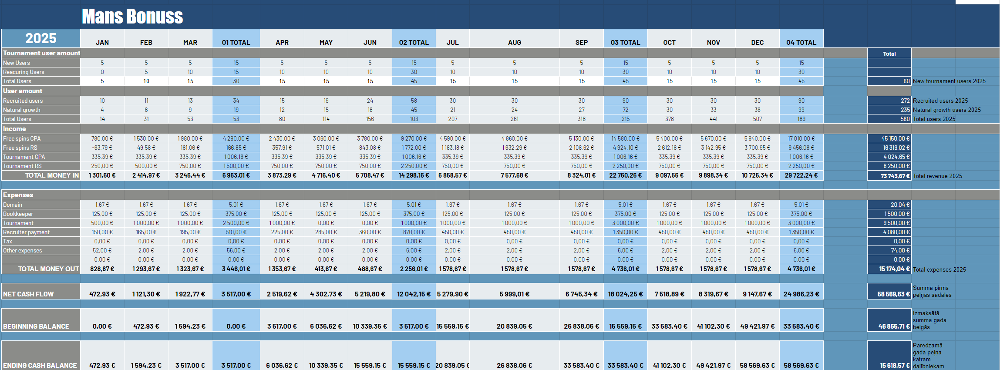
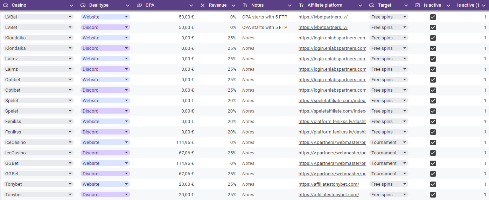
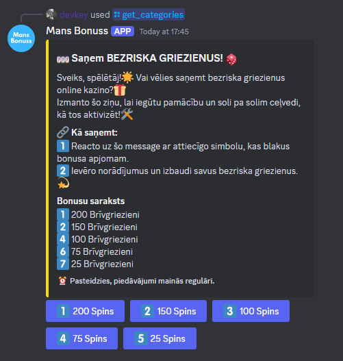

+++
title = "Managing affiliate finances: From spreadsheets to scalability"
date = 2024-12-25

[taxonomies]
categories = ["Finance", "Business"]
+++

"Everything is based on money for money." That's how our Finance Management course at Business Academy started, and it couldn't be more true for affiliate marketing. While most affiliate guides focus on traffic and conversions, they rarely mention the complex financial infrastructure needed to make it all work. Here's how we turned our casino affiliate project from a simple spreadsheet into a scalable financial system.

<!-- more -->
---

<a href="https://tenor.com/view/cash-fortress-snipers-eye-money-cold-hard-cash-lionsgate-gif-25657951">Cash Fortress Snipers Eye GIF</a>from <a href="https://tenor.com/search/cash-gifs">Cash GIFs</a>
 

> "The highest form of wealth is the ability to wake up every morning and say 'I can do whatever I want today.'" 
> 
> — Morgan Housel, The Psychology of Money

This quote resonated deeply with our approach to financial management. While building our affiliate business, we realized that true financial success isn't just about maximizing revenue - it's about creating systems that give you the freedom to grow sustainably.

## The Financial Reality of Affiliate Business

Running an affiliate business like [mansbonuss.com](https://mansbonuss.com) isn't just about placing links and watching commissions roll in. It's about building financial systems that can handle growth. Our journey taught us that success requires balancing four key elements:

1. **Initial Investment**: Website development, content creation, and marketing
2. **Operational Costs**: Hosting, tools, and team members
3. **Revenue Tracking**: Commission structures and payment cycles
4. **Scaling Costs**: Recruitment and expansion expenses

## Building a Financial Framework

### The Cashflow Sheet Evolution
What started as a simple Excel spreadsheet quickly evolved into a comprehensive financial tracking system. Our cashflow sheet tracks:

- **Revenue Streams**:
  - Casino affiliate commissions (ranging from 25% to 45% revenue share)
  - CPA deals (€20-€100 per qualified player)
  - Special promotion bonuses (up to €1000 for high-volume months)
  - Sub-affiliate revenue splits (70-30 in favor of recruiters)

- **Operational Expenses**:
  - Website hosting (€0/month on Vercel)
  - Discord bot hosting (€0/month on fly.io)
  - Marketing expenses (€100/month, primarily TikTok ads)
  - Team member compensation (commission-based)
  - Tournament bonuses (€500-1000 for top performers, 6x per year)
  - Domain (mansbonuss.com €20/year, mansbonuss.lv €12/year)

We also made a sheet to track all the casino deals we have. Since there are multiple affiliate dashboards we need to track, it's easier to have a single source of truth:

Detailed view available [here](https://docs.google.com/spreadsheets/d/1OCRmXs43I4-X9bnvNneVf5TuyqP-rk_7xpVSI4Go4Tg/edit?usp=sharing).

### The Discord Strategy

Our Discord server became the central hub of our operation, serving multiple purposes:

**Community Building**:

- Separate channels for each casino partner
- Exclusive deals and promotions
- Real-time support and updates
- Success story showcases

We hit 142 Discord members in 2 weeks. Before this sounds too exciting - the server initially had 130 members, but the 80% of the 12 were the ones who converted through physical poster, and the rest came through a Google Form with a link that displays after filling out the form.

**Affiliate Management**:

- Individual tracking links per affiliate
- Automated commission reporting
- Performance leaderboards
- Training resources

**Custom Bot Features**:

- Tutorial distribution on demand
- Commission calculation assistance
- Automated welcome messages
- Link verification system

## Our Growth Journey

### Phase 1: Foundation (Weeks 1-2)

- Set up basic website with first casino partnerships
- Created initial Discord server structure
- Established commission tracking system
- Developed basic tutorial content

### Phase 2: Optimization (Current)

- Improved website UI based on user feedback
- Enhanced Discord bot functionality
- Streamlined affiliate onboarding process
- Created detailed performance metrics

### Phase 3: Scaling (Weeks 5-6)

- Implementing recruiter program
- Expanding casino partnerships
- Developing automated systems
- Building training resources

## Financial Strategies That Worked

### 1. The Hybrid Commission Model

Instead of choosing between CPA and Revenue Share, we:

- Start affiliates with CPA for immediate rewards
- Transition to revenue share for long-term growth
- Offer hybrid options for risk management
- Provide performance-based bonuses

### 2. Recruiter Incentive Structure

Our recruiter program is built on:

- Base commission (€15 flat per conversion)
- Performance bonuses for hitting targets
- Training completion rewards
- Long-term retention incentives

### 3. Cashflow Management

We implemented a strict financial discipline:

- 40% reinvestment in growth
- 30% operational reserve
- 20% team compensation
- 10% emergency fund

## Technology Investment Strategy

Our tech stack evolved based on needs:

### 1. Website Platform

- Built on Next.js for speed and simplicity
- Mobile-first design
- SEO-optimized structure

### 2. Discord Integration

- Custom bot development in Typescript
- Automated reporting system
- Seamless navigation through casino bonuses
- Commission tracking integration

### 3. Analytics and Tracking

- Google Analytics 4 for traffic
- Custom event tracking
- Conversion monitoring
- ROI calculation per channel

## Key Learnings and Pivots

1. **Difficulty combining with the course**

    It's still difficult to combine team project with the course. We faced many roadblocks that set us back by a few weeks of potential progress. While we still managed to build a very rough MVP of the project, there's still way to go.

2. **Commission Structures**:
   - Higher CPA doesn't always mean better ROI
   - Revenue share provides more stable income
   - Hybrid models work best for retention

3. **Community Impact**:
   - Discord engagement directly correlates with earnings
   - Peer support reduces support overhead
   - Community success stories drive recruitment

## Future Roadmap

### Immediate Focus (Next 3 Months)

1. **Scaling Recruitment**:
   - Implement automated screening
   - Develop comprehensive training program
   - Create performance-based advancement system

2. **Technology Enhancement**:
   - Improve bot functionality
   - Automate more reporting features
   - Enhance tracking accuracy

3. **Financial Systems**:
   - Implement automated payments
   - Develop better forecasting models
   - Create detailed financial dashboards

## Final Insights

Managing affiliate finances isn't just about tracking commissions - it's about building systems that scale with your business. The key isn't to create perfect financial models, but to develop frameworks that adapt as you grow.

Remember: In affiliate marketing, your financial system needs to be as automated as your marketing. Otherwise, you'll spend more time managing money than making it.

[Financial Markets](https://www.coursera.org/account/accomplishments/certificate/PMTV278MAMV4)
