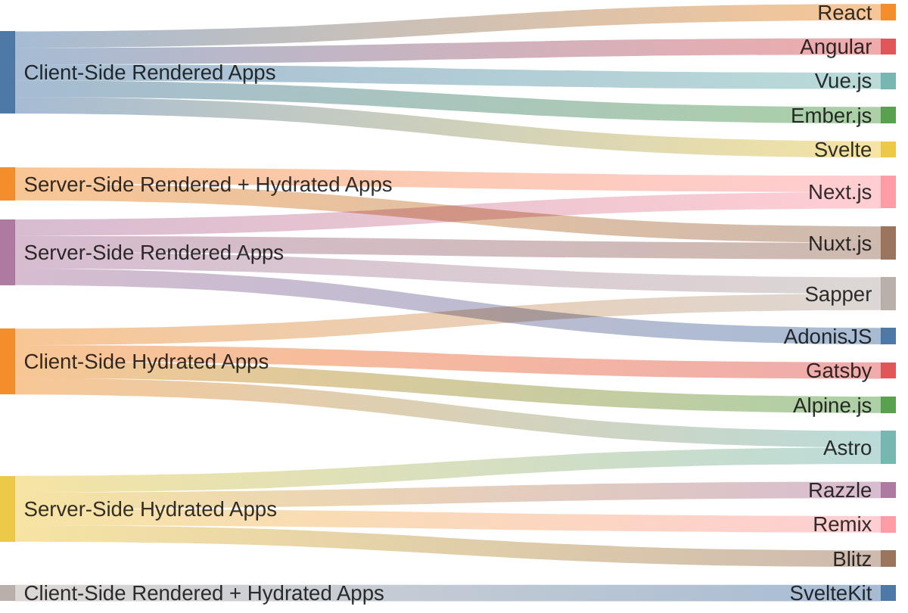

```mermaid
---
config:
  sankey:
    showValues: false
---
sankey-beta

Client-Side Rendered Apps,React,100
Client-Side Rendered Apps,Angular,100
Client-Side Rendered Apps,Vue.js,100
Client-Side Rendered Apps,Ember.js,100
Client-Side Rendered Apps,Svelte,100

Server-Side Rendered Apps,Next.js,100
Server-Side Rendered Apps,Nuxt.js,100
Server-Side Rendered Apps,Sapper,100
Server-Side Rendered Apps,AdonisJS,100

Client-Side Hydrated Apps,Sapper,100
Client-Side Hydrated Apps,Gatsby,100
Client-Side Hydrated Apps,Astro,100
Client-Side Hydrated Apps,Alpine.js,100

Server-Side Hydrated Apps,Razzle,100
Server-Side Hydrated Apps,Remix,100
Server-Side Hydrated Apps,Blitz,100
Server-Side Hydrated Apps,Astro,100

Client-Side Rendered + Hydrated Apps,SvelteKit,100

Server-Side Rendered + Hydrated Apps,Next.js,100
Server-Side Rendered + Hydrated Apps,Nuxt.js,100
```